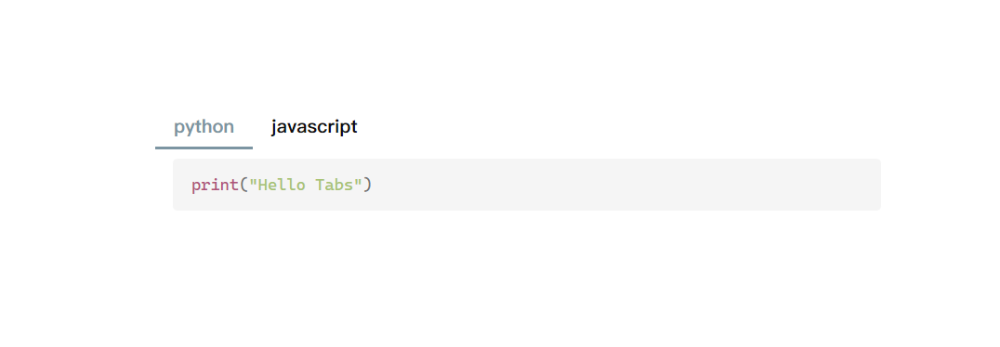
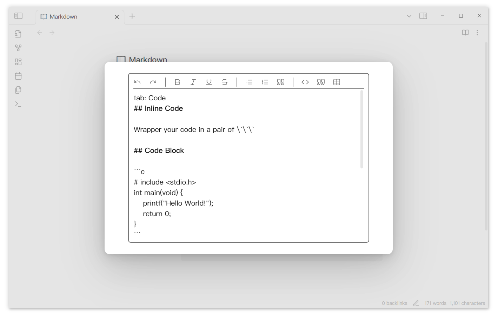

# Obsidian Tabs

Thanks to the [Code Tab](https://github.com/lazyloong/obsidian-code-tab) plugin for the inspiration, but since it had not been updated for a long time and it wasn't support edit content directly, I refactored the plugin and added a lot of features.

> [!WARNING] 
> **Please refrain from entering tasks directly within the Tabs code block.**
> 
> The Tabs function operates based on the code block. In Obsidian, text within a code block is treated as plain text. Consequently, if you input tasks inside a code block, neither the tasks plugin nor the dataview plugin will be able to recognize them.


## Usage

### 1. Create a tabs code block

Generate a tab component using the tab code block.

````
```tabs
tab: TAB ONE
Content of TAB ONE

tab: TAB TWO
Content of TAB TWO
```
````

### 2. With other code block

If your tab contents have code block, you need to use more `, like

`````
````tabs
tab: python
```python
print("Hello Tabs")
```

tab: javascript
```javascript
console.log('Hello Tabs');
````
`````

Or you can use '~' to create code block, like

````
~~~tabs
tab: python
```python
print("Hello Tabs")
```

tab: javascript
```javascript
console.log('Hello Tabs');
```
~~~
````




With this feature, you can create tabs component nested.

`````
````tabs
tab: TAB-ONE
An innerTab in TAB-ONE 👇

```tabs
tab: inner tab one
This is an inner tab.

tab: inner tab two
This is an inner tab.
```

tab: TAB-TWO
````
`````

or use '~' to create code block(inside or outside).

````
~~~tabs
tab: TAB-ONE
An innerTab in TAB-ONE 👇

```tabs
tab: inner tab one
This is an inner tab.

tab: inner tab two
This is an inner tab.
```

tab: TAB-TWO
~~~
````


### 3. Customize your tabs

Add configuration information at the beginning(comma separate). Only the last configuration of the same type takes effect.

````
```tabs
top, multi
tab: TAB 1
Tab content
tab: TAB 2
Tab content
```
````

| Configuration |                  Explanation                  |
| :-----------: | :-------------------------------------------: |
|     top       | Tabs nav bar will be displayed at the top.    |
|     left      | Tabs nav bar will be displayed on the left.   |
|     right     | Tabs nav bar will be displayed on the right.  |
|     bottom    | Tabs nav bar will be displayed at the bottom. |
|     one       | Tabs nav bar can scroll with many nav items.  |
|     multi     | Tabs nav items will show in multi line.       |


### 4. Edit tab

Double click the content can rouse an editor if you turn on the setting 'Double click to edit'. You can also use action button if you set it to 'Edit tab' in setting.

The editor automatically saves the edited content. You can change the interval between your last editing and editor saving in setting 'Auto saving interval'. Content will be saved when the editor is closed. You can also use the shortcut `Ctrl+S` to save the editing content.



If you want to delete a tab, you can right click the tab and delete it.


If you accidentally delete a tab, you can use `ctrl z` to restore it.

You can quickly create a new tab using the contents of the clipboard.


tip: if tab nav is too long, try to hold `shift` and scroll.

Remember to click the save button after editing.

### 5. Command

Provides a command to quickly create or convert selected text to a Tabs component. Click `Cmd-p` to open the setting pannel. Search for 'Tabs'.


## Showcase

Insert a tab component into markdown file.


With Dataview & Tasks

From [DeusEx01](https://github.com/xhuajin/obsidian-tabs/issues/28)


With LeetCode


Tab nav on the left


Tabs in mobile, from [DeusEx01](https://github.com/xhuajin/obsidian-tabs/issues/28)


> If you have a usage you'd like to share, feel free to raise an issue or pull a request. I'll add it to readme.

## Todo

- Draggable tab nav item.
- Obsidian native editor (Live preview mode)
